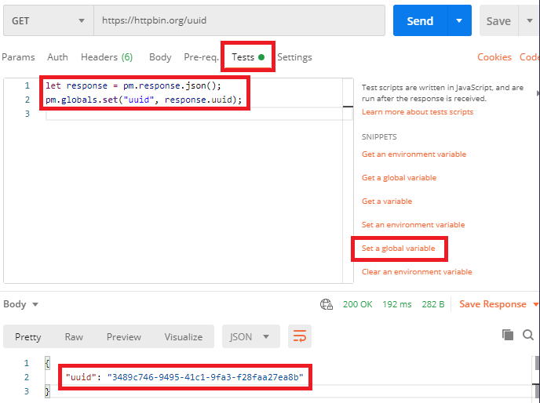
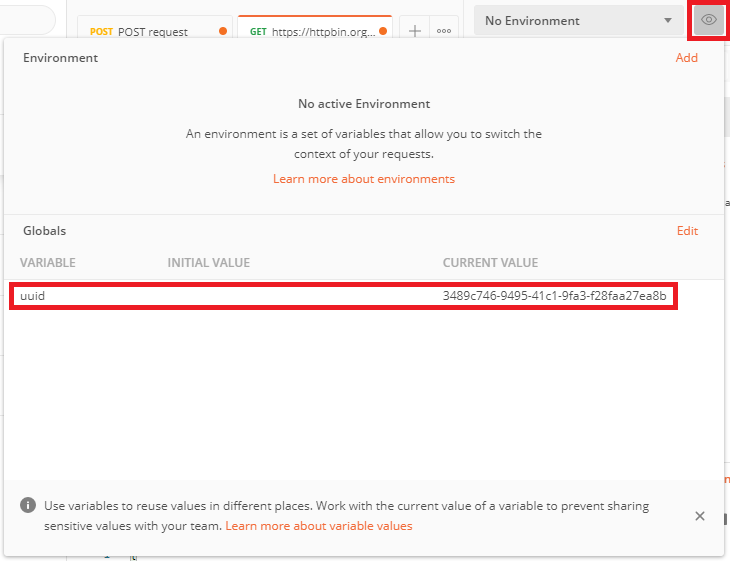
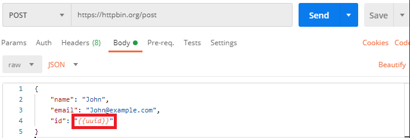
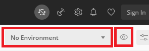
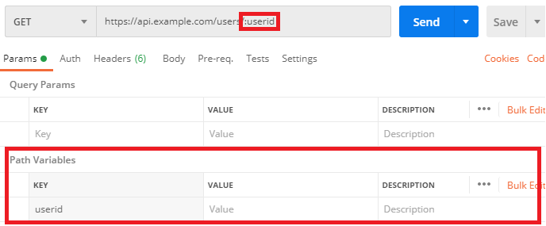
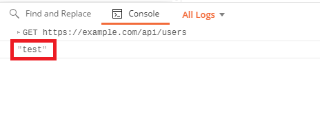
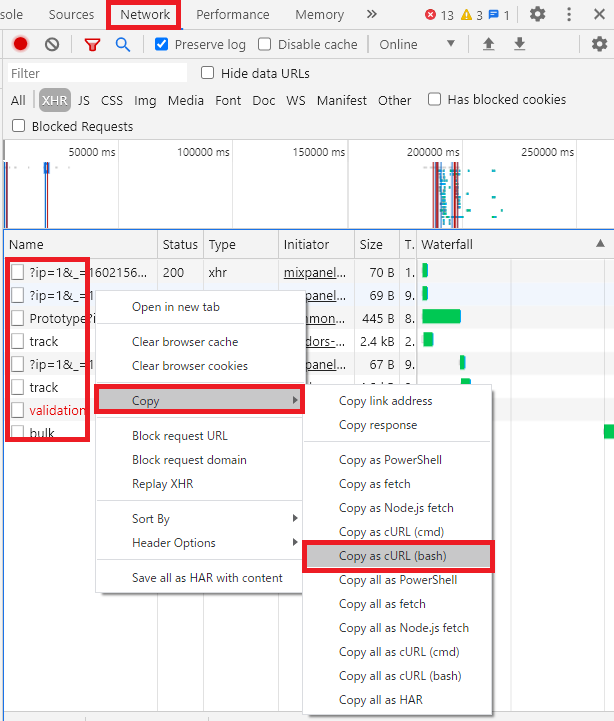
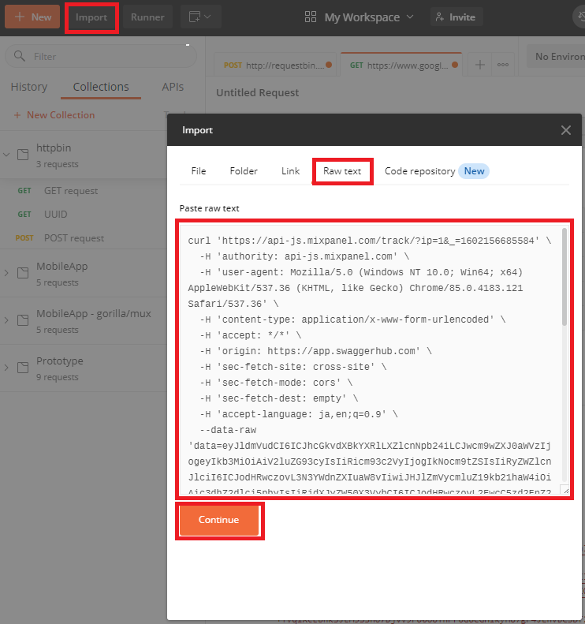
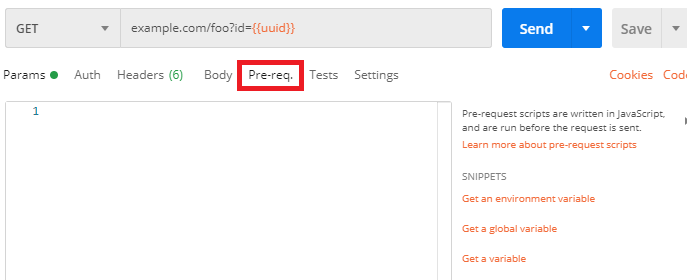

## 変数のスコープ

### グローバル変数
- 他のスコープに変数が見つからない場合、グローバル変数が参照される
- できるだけ他のスコープ変数を使う

#### 使用例
HTTPリクエストの結果をグローバル変数にセットし、別のリクエストで同変数を参照する

1. "Tests" を開く
2. "SNIPPETS" → "Set a global variable" 
3. コードでグローバル変数にセット




リクエストを送信すると、グローバル変数に値がセットされる




以降、{{hoge}}でグローバル変数を取り出せる（リクエストビルダーならどこでも）




### 環境変数
- サーバーの切り替えなどに使う
- サーバーのURL
- 認証情報（ID、パスワード）

※変数を使わなくなったら削除することを推奨

```javascript
// グローバル変数
pm.globals.get('hoge');

// 狭いスコープの変数を優先的に参照
// できるだけこちらを使う
pm.variables.get('hoge');
```

環境を切り替えることで、グローバル変数よりも環境変数を優先的に参照できる

環境変数の設定は「目」のアイコンをクリック




## パラメータ

### パスパラメータ

":hoge" の書式でパスパラメータを使用できる




### テストの書き方

Chai Assertion Library を参照

<https://www.chaijs.com/>

```javascript
pm.test("Status code is 200", function () {
   let a = {
      "name": "John"
   };
   let b = {
      "name": "John"
   };

   // 同じ値である
   pm.expect(hoge)).to.eql(b, 'must be the same value');

   // 同じ値ではない
   pm.expect(hoge).to.not.eql(b);

   // 同じオブジェクトである
   pm.expect(hoge).to.equal(b, 'must be the same object');

   // true である
   pm.expect(hoge).to.be.true;

   // null である
   pm.expect(hoge).to.be.null;

   // undefined である
   pm.expect(hoge).to.be.undefined;

   // 空の配列 である
   pm.expect([]).to.be.empty;
   pm.expect([].length).to.eql(0);
   
   // 含む
   pm.expect([1, 2, 3]).to.include(2);

   // いずれかである
   pm.expect(hoge).to.be.oneOf([1, 2, 3]);

   // 正規表現
   pm.expect('John Doe').to.match(/^John/);
});
```

### デバッグの方法

"Tests" にて `console.log('hoge');` を実行すると、コンソールに結果が出力される





## その他

### ブラウザからHTTPリクエストをコピー

1. "Network" をクリック
2. 必要に応じて "Preserve log" をチェック
3. ブラウザを操作してHTTPリクエストを送信
4. HTTPリクエストの一覧を右クリック
5. "Copy" をクリック
6. "Copy as cURL" をクリック（クリップボードにコピーされる）



1. "Import" をクリック
2. "Raw text" をクリック
3. クリップボードからコピー
4. "Continue" をクリック




### リクエスト送信の前処理

リクエストを動的に変更することが可能




